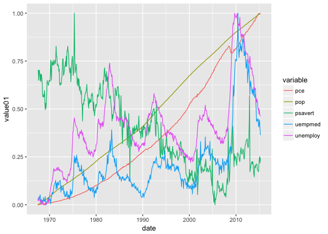
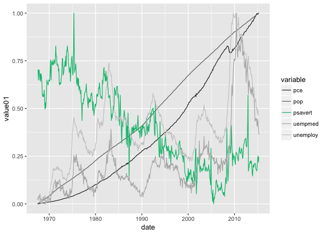

<!-- README.md is generated from README.Rmd. Please edit that file -->
Overview
--------

ggfocus is an extension to [ggplot2](http://ggplot2.tidyverse.org) that adds scales for emphasizing different features of a plot.

Installation
------------

``` r
# install.packages("devtools")
devtools::install_github("dylan-stark/ggfocus")
```

Usage
-----

Just add a `scale_colour_focus()` call to your plots at set the position (`pos`) argument to the position in the color scale that you want to emphasize. The selected position will retain it's color while all other positions will map to gray scale. Here's an example:

``` r
library(ggplot2)
library(ggfocus)

p3 <- ggplot(economics_long, aes(date, value01, colour = variable)) +
  geom_line()

p3
```



``` r
p3 + scale_colour_focus(3)
```



Check out the package vignette (`vignette("ggfocus")`) for more examples.
